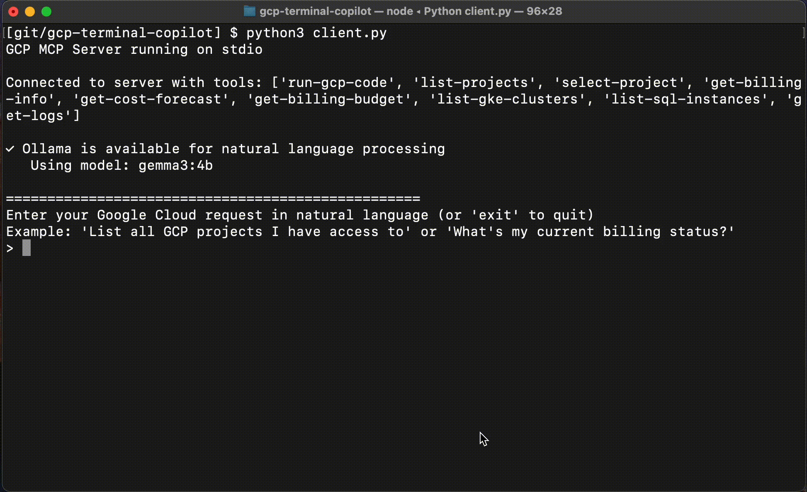

# GCP Terminal Copilot

A Python-based GCP CLI assistant that provides natural language processing capabilities for `gcloud` commands leveraging [GCP MCP Server](https://github.com/eniayomi/gcp-mcp).



## Prerequisites

- Python 3.11+ (as specified in pyproject.toml)
- [gcloud CLI](https://cloud.google.com/sdk/docs/install) installed and configured
- [Ollama](https://ollama.com) with a model downloaded
- [uv](https://github.com/astral-sh/uv) for Python package management
- [GCP MCP server installed and running](https://github.com/eniayomi/gcp-mcp)

## Installation

1. Clone the repo

    ```bash
    git clone https://github.com/thaneshp/gcp-terminal-copilot
    cd gcp-terminal-copilot
    ```

1. Open the terminal and Start a virtual env with uv

    ```bash
    uv venv
    ```

1. Install packages using uv

    ```bash
    uv pip install .
    ```

1. Run Ollama and make note of its local address
1. Run GCP MCP server and make note of its local path
1. Rename `.env-sample` to `.env`
1. Update with the values that correspond to your locally running Ollama, GCP MCP executable path, and model you want to use
1. Run `gcloud auth application-default login` to authenticate to you Google Cloud account
1. You can now run `python client.py`

## Running Tests

### DeepEval

DeepEval is a testing framework for evaluating and testing LLM applications. 

`gcp-terminal-copilot` uses `deepeval` to evaluate whether the translation generated by a given model aligns with the command options provided by [GCP MCP Server](https://github.com/eniayomi/gcp-mcp)

It does this by using the LLM-as-a-Judge approach which evaluates generated responses and feeds them through another LLM.

#### How to Run

1. Edit [`tests/deepeval/config.py`](./tests/deepeval/config.py) to set your desired system prompts and models.

    - You can create new system prompts under the [prompts/system](./prompts/system/) dir and reference them in the `SYSTEM_PROMPTS` list.

2. Export your OpenAI API key (required for the LLM Judge):

    ```bash
    export OPENAI_API_KEY=sk-... 
    ```

    > **Note:** *By default DeepEval uses OpenAI as the LLM Judge. If you prefer to use another LLM as a Judge, you can change this by following the DeepEval documentation [here](https://www.deepeval.com/docs/metrics-introduction#llm-judges).*
    
3. Run the tests

    ```bash
    deepeval test run tests/deepeval/test_command_translation.py
    ```

    > **Note:** *If you prefer to see results on a GUI and/or save results in the cloud, you can setup a [deepeval account](https://www.deepeval.com/docs/getting-started#save-results-on-cloud).*

## Troubleshooting

- Make sure your `gcloud` cli is logged in, GCP MCP uses that as auth

## License

This project is licensed under the MIT License - see the [LICENSE](LICENSE) file for details.
